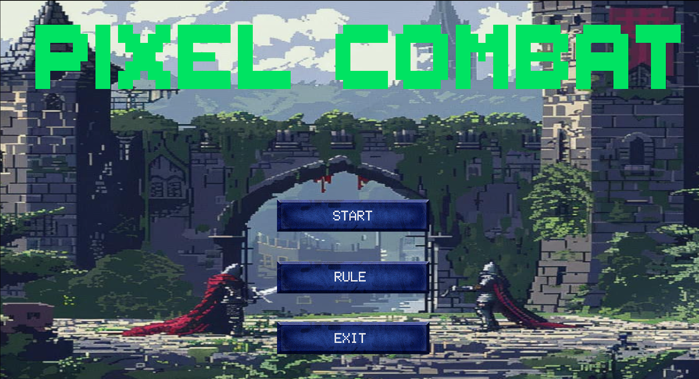
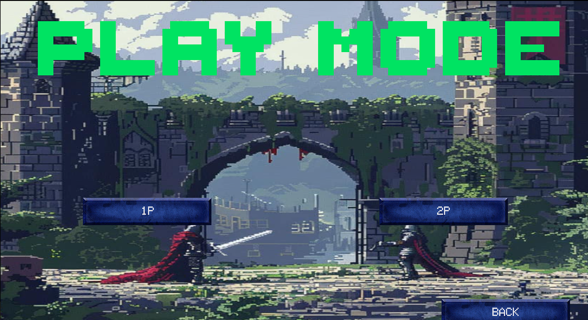
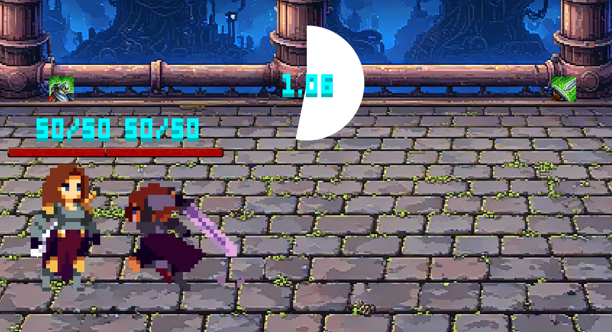

# **Pixel Combat - 地下勇士之爭**

*（圖片說明：Pixel Combat 的遊戲封面）*

Pixel Combat 是一款緊張刺激的像素風格對戰遊戲，兩位地下勇士在競技場中展開激烈的死鬥！遊戲結合了簡單的操作方式與獨特的祝福系統，考驗玩家的策略與心理。挑戰你的朋友，爭奪地下競技場的冠軍榮耀！

---

## **目錄 (Table of Contents)**
1. [介紹 (Introduction)](#介紹-introduction)
2. [遊戲特點 (Features)](#遊戲特點-features)
3. [系統需求 (System Requirements)](#系統需求-system-requirements)
4. [安裝與運行 (Installation & Running)](#安裝與運行-installation--running)
5. [操作與規則 (Gameplay & Rules)](#操作與規則-gameplay--rules)
6. [開發者筆記 (Developer Notes)](#開發者筆記-developer-notes)
7. [授權 (License)](#授權-license)

---

## **介紹 (Introduction)**

Pixel Combat 是一場榮耀的決鬥！玩家將扮演地下勇士之一，進行三局兩勝制的回合對戰，考驗你的判斷力與快速反應。選擇方向，預測對手的動作，並利用祝福效果改變戰局。

遊戲規則簡單，但充滿深度，適合快速上手與好友一同遊玩！

---

*（圖片說明：Pixel Combat 的遊戲模式介面）*

## **遊戲特點 (Features)**

- **單/雙人對戰**：支援玩家對玩家與玩家對電腦模式，與朋友一決高下！  
- **簡單操控**：透過鍵盤選擇方向，滑鼠僅操作 UI 按鈕，讓戰鬥專注於決策與博弈。  
- **祝福系統**：每個大回合開始前選擇祝福條件，隨機增益可能逆轉勝負。  
- **無暫停功能**：比賽全程無間斷，讓緊張感加倍。  
- **像素美學**：經典像素風格與懷舊音效，重現遊戲最純粹的樂趣。  

---

## **系統需求 (System Requirements)**

- **作業系統 (OS)**: Windows 10  
- **處理器 (Processor)**: Intel Core i3 或更高  
- **記憶體 (Memory)**: 2GB RAM  
- **顯示卡 (Graphics)**: 支援 DirectX 10 的顯卡  
- **儲存空間 (Storage)**: 至少 300MB 可用空間  

**注意**：不支援 Mac 作業系統。  

---

## **安裝與運行 (Installation & Running)**

1. 下載最新版本的遊戲檔案：  
   [下載連結]( https://github.com/denny7871345/Pixel-Combat/tree/main)
2. 解壓縮檔案至指定目錄。  
3. 雙擊 `PixelCombat.exe` 啟動遊戲。  

---

## **操作與規則 (Gameplay & Rules)**

### **基本操作**

| **動作**            | **按鍵**          |  
|--------------------|------------------|  
| 1P 選擇方向       | `A`, `S`, `D`    |  
| 2P 選擇方向       | `J`, `K`, `L`    |  
| 滑鼠操作          | 點擊 UI 按鈕進行互動 |  

---

*（圖片說明：Pixel Combat 的遊戲畫面）*

### **遊戲規則**

1. **遊戲模式**：  
   - 支援 玩家對玩家 / 玩家對電腦 對戰模式。  
2. **祝福機制**：  
   - 每個大回合開始時，玩家透過鍵盤（1P 使用 `A`, `S`, `D`；2P 使用 `J`, `K`, `L`）選擇一個觸發祝福的條件（攻擊命中時 || 受擊時 || 成功格檔時(觸發兩次)）。  
   - 達成條件後，系統會隨機給予玩家增益效果，如攻擊力提升或恢復生命值。  
3. **小回合對戰**：  
   - 雙方分為進攻方與防守方，選擇攻擊或防守方向（左、中、右）。  
   - 若方向不一致，進攻方成功攻擊並造成傷害；若方向一致，防守方成功抵擋攻擊。  
4. **勝負條件**：  
   - 小回合結束時，血量歸零的玩家失敗。  
   - 若經過 10 個小回合仍未分出勝負，該局判為平手，無人得分。  
5. **比賽結束**：  
   - 採三局兩勝制，率先贏得兩分的玩家獲勝。  

---

## **開發者筆記 (Developer Notes)**

此遊戲使用 Unity 引擎開發，專注於簡單操作與快速決策的雙人競技樂趣。  

- **遊戲版本**：v1.0.0  
- **Unity 版本**：2022.3.x  
- **貢獻者**：  
  - [Denny Lin](https://github.com/denny7871345)  

如有任何建議，請在 Issues 中留言！  

---

## **授權 (License)**

此專案採用 [MIT License](LICENSE)。  

遊戲素材部分來源於開源資源，具體版權資訊請參考 [Assets 資料夾](Assets/README.md)。  
